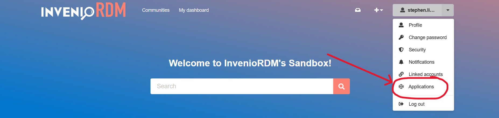
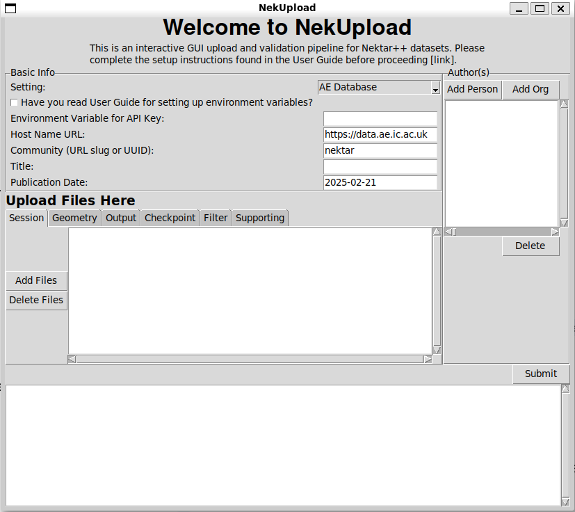

Quickstart
==========

For the quickstart guide, it is assumed that users are attempting to upload Nektar++ datasets to the Department of Aeronautics (Imperial College London) database hosted at https://data.ae.ic.ac.uk. 

Installation
------------

With all python-based projects, it is highly recommended to create a virtual environment to prevent depdendency conflicts. Once your virtual environment is established, install the local application and CLI tool using:

.. code::

    pip install NekUpload

Setup
-----

An API key is required to utilise this application. To access an API key, go to the online repository host (in this case https://data.ae.ic.ac.uk). Login to your account and select your profile. You will see an option: *Applications*, as shown in the following image:

Under *Personal access tokens*, click *new token* to generate an API key. Provide it with a name, and under *scopes* you should select **deposit:write**. Then create the API key.

.. tip::

    If you do not see the option to select **deposit:write** under scopes, then you already have those permissions. Continue and create the API key.

You will have one chance to see your API key. You now have two choices: 

1. Store in *.env* file
2. Export as environment variable

Store in *.env* file
^^^^^^^^^^^^^^^^^^^^

 Create a *.env* file in your current working directory (same directory as where you will later open the program) and store the key as follows:

.. code::

    # You can choose how you would like to name it
    QUICKSTART_DB_KEY=<YOUR KEY HERE>

.. warning::

    Never commit the .env file to version control, as this will expose your API key.

This is the preferred method when working locally, as it will be easier to remember what environment variable you have used. 

Export as Environment variable
^^^^^^^^^^^^^^^^^^^^^^^^^^^^^^

Add the API key as an environment variable.

For Linux/macOS:

.. code::

    export QUICKSTART_DB_KEY=<YOUR KEY HERE>

You can also add these to your .bashrc or other shell configuration files for persistence.

.. warning::

    Adding API keys to shell configuration files can be useful if you need to run multiple times, but API keys should be deleted after use anyway.

For Windows:

.. code::

    set QUICKSTART_DB_KEY=<YOUR KEY HERE>

You can use the System Properties dialog to set persistent environment variables.

.. warning::

    Once again, persistent keys are useful for re-use, but it is recommended that API keys are deleted after use for security reasons. Decide whether you would benefit from persistent keys before setting them persistently.

Local Application
-----------------

To execute the local application, run:

.. code::

    nekupload-app

This should open up a tkinter application: 

.. note::
    This app requires a modern version of TKinter, (versions >= 8.5). This is usually packaged with Python installations. The app may appear different in different environments, as it uses system native widgets.

For *setting*, select AE Database. This should be the default. This prepopulates information on where the online repository is hosted and which community to upload the dataset to. Mandatory fields under basic info to be filled out are:

* **Environment Variable for API Key:** The name of the environment variable holding the API key. In our case this would be *QUICKSTART_DB_KEY*
* **Title:** Provide a title describing the dataset e.g. NACA 0012 simulation at Re = ...
* **Publication Data:** Prepopulated with today's date, but any valid YYYY-MM-DD format is accepted

At least one author is required, and can be added by selecting *Add Person* or *Add Org* (organisation). At minimum, one session file, one geometry file and one output file should be specified. This should follow Nektar++ best practices. 

Once complete, hit submit. Watch the terminal messages to be notified of failure (and reason of failure) or successful upload. You can check the online portal hosted at https://data.ae.ic.ac.uk to check that data has indeed been uploaded for successful uploads.

.. warning::

    For security reasons, once you are done uploading, please delete your API key by logging back onto the online portal and deleting the key. You can always regenerate a new one at a future date.